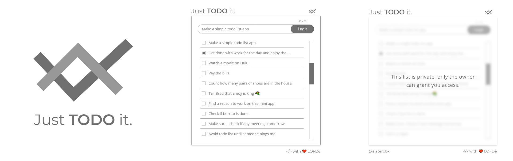

### WORK IN PROGRESS
Not yet functioning, still in the planning stages. Stay tuned.

# Just TODO.cli it
## CLI command line todo: list app

#### Work in progress CLI for a GUI project managment system thats integrated with Git and project files
- Simple CLI interface for a CLI / GUI todo list app ( cross team project managment )
- Possible plugins for monday.com or similar
- GUI version will be created in React / Electron ( pc / mac / linux ) and React Native for Android / ios devices.
- Node Package for Windows users / Web developers ( CLI )
- Managed using a combination of files and git
- Live backend database sync with GUI payed service / free personal or self hosting
- Available for the regular user as a todo list app for pc / phone integration ( app store )

#### Important considerations
The goal is to create a CLI that integrates with a projects codebase to handle "todo" tasks that are put into projects code via direct input, or CLI. A GUI ( mobile and desktop ) will be created for higher level project managers / investers to pass down "tasks" that can get picked up / handed out to programming team members via GUI app or CLI. The codebase will sync up with a live database or run in local project only via git managment. Files are parsed, organized and managed automatically via custom markdown.

#### Looking for investors / programmers
